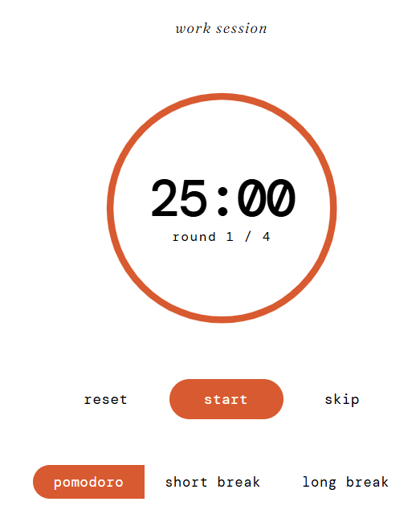
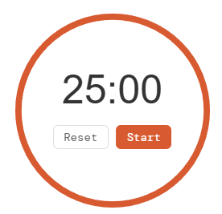
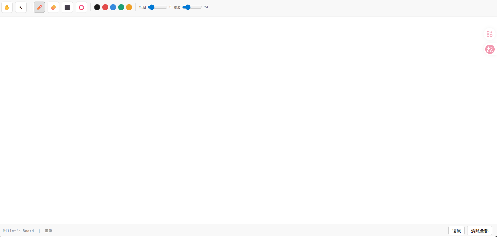
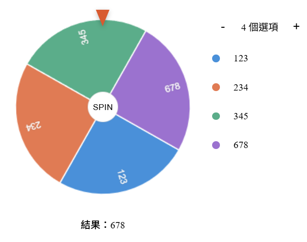

# 🚀 Miller's Productivity Toolkit for Notion

這一系列專為 Notion 打造的極簡小工具，旨在減少開發與學習時的認知負荷。透過 GitHub Pages 部署，你可以輕鬆地將它們嵌入到你的 Notion Dashboard 側邊欄或工作區。

## 🤖 多 AI 協作開發
本專案由 **Miller** 主導，並根據功能需求與多款 AI 進行深度疊代：

- **版本一：標準番茄鐘 (Standard Pomodoro)**
  - **協力開發**：**Claude**
  - **設計語彙**：經典大圓環，視覺平衡感佳。
- **版本二：內嵌按鈕番茄鐘 (Compact Pomodoro)**
  - **協力開發**：**Gemini**
  - **設計語彙**：極致縮小體積，將控制項整合於圓環內，專為 Notion 側邊欄設計。
- **版本三：隨手隨畫小白板 (Miller's Whiteboard)**
  - **協力開發**：**Claude**
  - **核心技術**：支援 **LocalStorage 自動儲存**、物理級「即時切斷」橡皮擦、獨立筆觸/擦除大小設定。
- **版本四：極簡決策轉盤 (Decision Spinner)**
  - **協力開發**：**Claude & Gemini**
  - **核心技術**：精準座標校準（指針對齊 12 點鐘方向）、動態增減選項（2-10 個）、自定義任務名稱。

## 📸 介面預覽

| 工具名稱 | 介面截圖 | 開發協力 |
| :--- | :--- | :--- |
| **標準番茄鐘** |  | Claude |
| **內嵌番茄鐘** |  | Gemini |
| **隨手小白板** |   | Claude |
| **決策轉盤** |  | AI Mix |

## 🛠️ 功能亮點

### 🎨 專業級小白板
- **自動儲存**：筆跡自動存於瀏覽器緩存，重新整理 Notion 也不會丟失進度。
- **無限畫布**：切換至手掌模式 (✋) 即可自由移動座標空間。
- **真實擦除**：橡皮擦不再是刪除整個物件，而是像真實白板一樣「擦除經過路徑」。

### 🎡 精準決策轉盤
- **座標修正**：解決 Canvas 渲染與 CSS 指針的 $90^\circ$ 偏差，確保指到哪、結果就是哪。
- **動態選項**：點擊 `+` / `-` 即時增減扇形數量。
- **極簡體積**：完全移除邊距留白，完美適應窄版側邊欄。

## 📦 如何安裝到 Notion？
1. 將此儲存庫 Clone 並開啟 GitHub Pages 服務。
2. 在 Notion 中輸入 `/embed`。
3. 貼上對應的 URL：
   - `.../pomodoro timer.html` (標準番茄鐘)
   - `.../pt.html` (內嵌番茄鐘)
   - `.../whiteboard.html` (小白板)
   - `.../choose.html` (決策轉盤)

---
*Designed for Deep Work & Efficiency* *Developed with AI Collaboration by **Miller***
